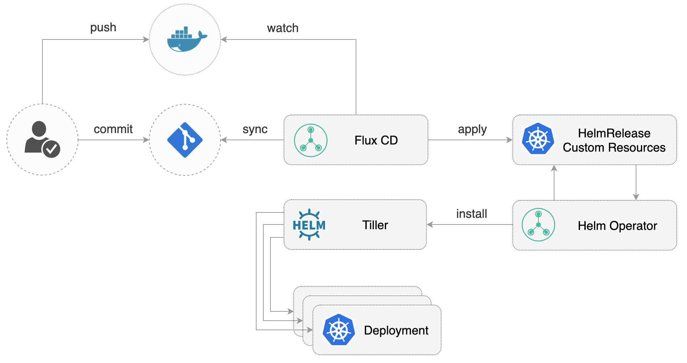

# Helm Operator

The Helm Operator provides an extension to [Flux](https://github.com/fluxcd/flux)
that automates Helm Chart releases in a GitOps manner.
A Chart release is described through a Kubernetes custom resource named HelmRelease. 
The Flux daemon synchronizes these resources from git to the cluster, 
and the Helm Operator makes sure Helm charts are released as specified in the resources.

## Helm Operator features

* declarative helm install/upgrade/delete of charts
* pulls charts from public or private Helm repositories over HTTPS
* pulls charts from public or private Git repositories over SSH
* chart release values can be specified inline in the HelmRelease object or via secrets, configmaps or URLs
* automated chart upgrades based on container image tag policies (requires Flux)
* automatic purging on chart install failures
* automatic rollback on chart upgrade failures
* supports both Helm v2 and v3

## Get started with the Helm Operator

Get started [installing the Helm operator](/chart/helm-operator/README.md)
or just [browse through the documentation](https://docs.fluxcd.io/projects/helm-operator/en/latest/).

### Integrations

As Flux Helm Operator is Open Source, integrations are very straight-forward. Here are
a few popular ones you might want to check out:

- [Progressive Delivery workshop (Helm v3 alpha)](https://helm.workshop.flagger.dev/)
- [Managing Helm releases the GitOps way](https://github.com/fluxcd/helm-operator-get-started)
- [GitOps for Istio Canary deployments](https://github.com/stefanprodan/gitops-istio)

## Community & Developer information

We welcome all kinds of contributions to Helm Operator, be it code, issues you found,
documentation, external tools, help and support or anything else really.

The FluxCD projects adheres to the [CNCF Code of
Conduct](https://github.com/cncf/foundation/blob/master/code-of-conduct.md).

Instances of abusive, harassing, or otherwise unacceptable behavior
may be reported by contacting a _Flux_ project maintainer, or the CNCF
mediator, Mishi Choudhary <mishi@linux.com>.

To familiarise yourself with the project and how things work, you might
be interested in the following:

- [Our contributions guidelines](CONTRIBUTING.md)
- [Build documentation](https://docs.fluxcd.io/en/latest/contributing/building.html)
- [Release documentation](/internal_docs/releasing.md)

## Getting Help

If you have any questions about Helm Operator and continuous delivery:

- Read [the Helm Operator docs](https://docs.fluxcd.io/projects/helm-operator/).
- Invite yourself to the <a href="https://slack.cncf.io" target="_blank">CNCF community</a>
  slack and ask a question on the [#flux](https://cloud-native.slack.com/messages/flux/)
  channel.
- To be part of the conversation about Helm Operator's development, join the
  [flux-dev mailing list](https://lists.cncf.io/g/cncf-flux-dev).
- [File an issue.](https://github.com/fluxcd/helm-operator/issues/new)

Your feedback is always welcome!
