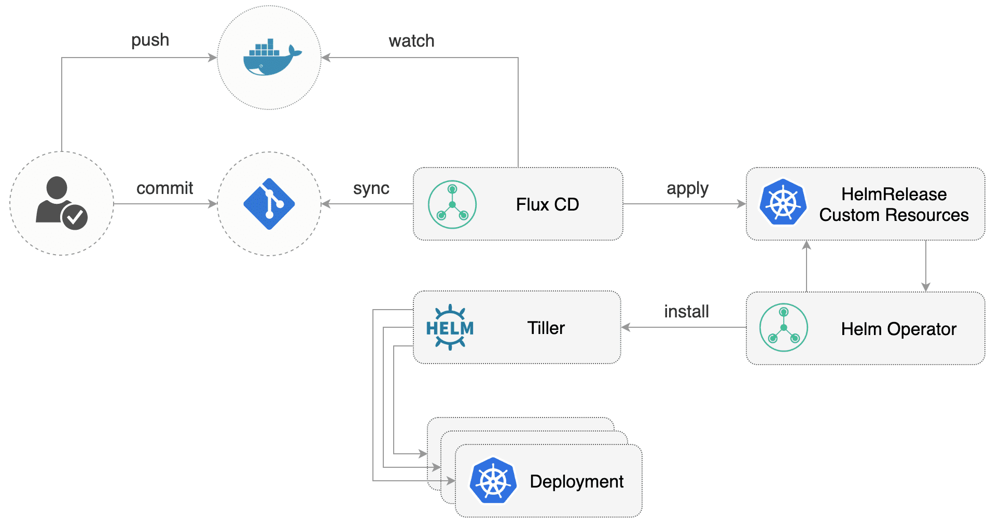

# Helm Operator

## Helm Operator features

* Declarative install, upgrade, and delete of Helm releases
* Pulls chart from _any_ chart source;
    * Public or private Helm repositories over HTTP/S
    * Public or private Git repositories over HTTPS or SSH
    * Any other public or private chart source using one of the available
      [Helm downloader plugins](https://helm.sh/docs/topics/plugins/#downloader-plugins)
* Allows Helm values to be specified;
    * In-line in the `HelmRelease` resource
    * In (external) sources, e.g. `ConfigMap` and `Secret` resources,
      or a (local) URL
* Automated purging on release install failures
* Automated (optional) rollback on upgrade failures
* Automated image upgrades [using Flux](https://docs.fluxcd.io/en/stable/references/helm-operator-integration.html)
* Automated (configurable) chart dependency updates for Helm charts
  from Git sources on install or upgrade
* Detection and recovery from Helm storage mutations
  (e.g. a manual Helm release that was made but conflicts with the
  declared configuration for the release)
* Parallel and scalable processing of different `HelmRelease` resources
  using workers
* Supports both Helm 2 and 3

## Tutorials

- [How to bootstrap Helm Operator using Kustomize](tutorials/get-started-kustomize.md)
- [Get started with the Helm Operator and Tiller](tutorials/get-started.md)

## References

- [Operator reference](references/operator.md)
- [HelmRelease Custom Resource](references/helmrelease-custom-resource.md)

## HelmRelease guide

- [Introduction](helmrelease-guide/introduction.md)
- [Chart sources](helmrelease-guide/chart-sources.md)
- [Values](helmrelease-guide/values.md)
- [Release configuration](helmrelease-guide/release-configuration.md)
- [Reconciliation and upgrades](helmrelease-guide/reconciliation-and-upgrades.md)
- [Rollbacks](helmrelease-guide/rollbacks.md)
- [Automation](helmrelease-guide/automation.md)
- [Debugging](helmrelease-guide/debugging.md)

## How-to

- [Upgrade to GA](how-to/upgrade-to-ga.md)
- [Upgrade to Beta](how-to/upgrade-to-beta.md)

## Troubleshooting

- [FAQ](faq.md)
- [Troubleshooting](troubleshooting.md)
